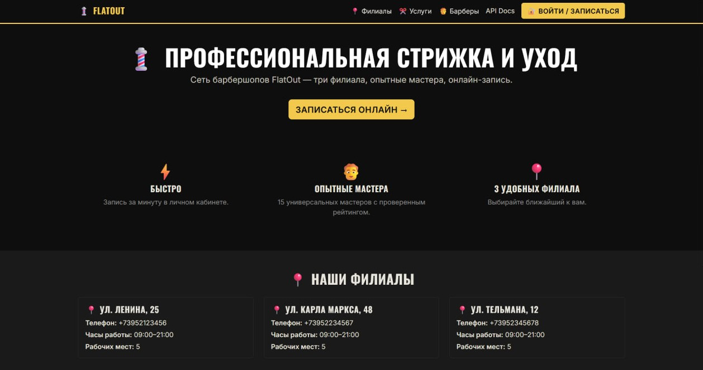
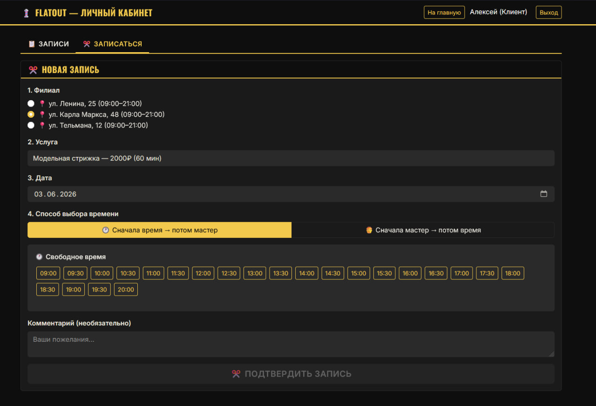
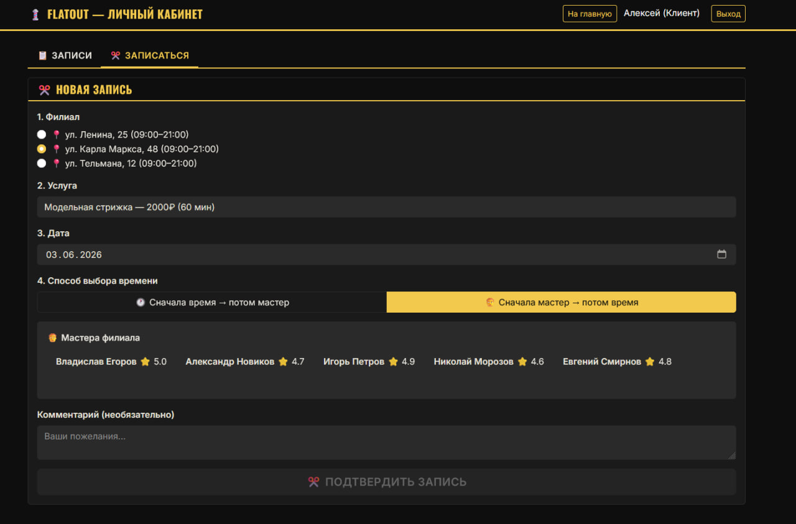
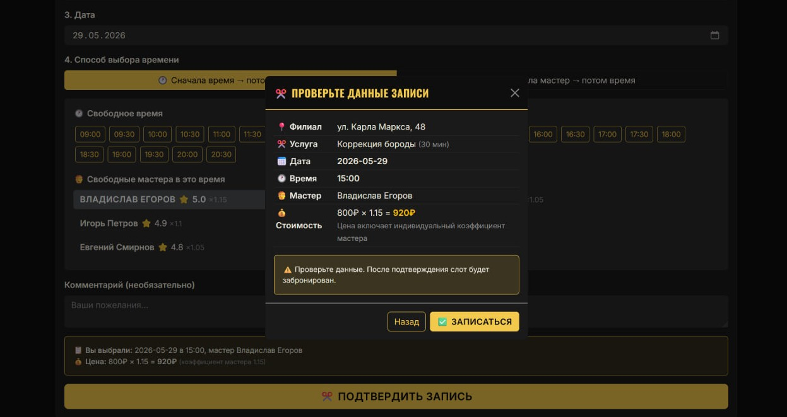
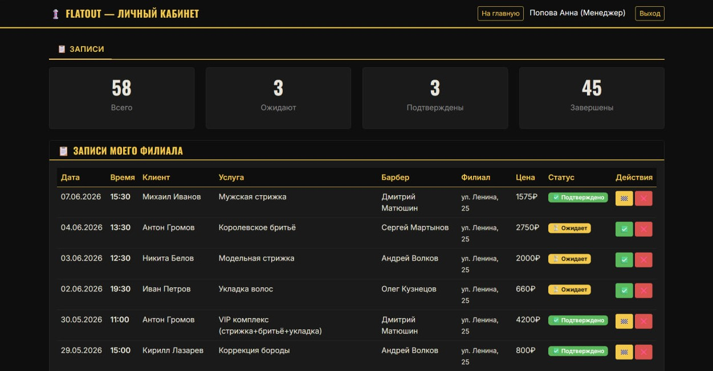

# 💈 FlatOut — Barbershop Management Platform

Веб-платформа для сети барбершопов: онлайн-запись, ролевая модель «клиент / барбер / менеджер / администратор», управление расписанием филиалов и аналитика. Курсовая работа по дисциплине «Проектирование информационных систем»


git 


---

## 📸 Скриншоты

### Главная страница


### Форма записи

Два режима выбора слота: «сначала время → потом мастер» и «сначала мастер → потом время».

<table>
  <tr>
    <td></td>
    <td></td>
  </tr>
  <tr>
    <td align="center"><i>Сначала время → потом мастер</i></td>
    <td align="center"><i>Сначала мастер → потом время</i></td>
  </tr>
</table>

### Модалка подтверждения с расчётом цены


### Дашборд менеджера


---

## ✨ Возможности

- **Лендинг** с описанием сети, карточками филиалов, каталогами услуг и мастеров.
- **Регистрация и авторизация** клиентов с серверной и клиентской валидацией: имя без цифр, телефон только цифры (с опциональным `+`), email с проверкой формата, пароль не короче 8 символов.
- **Онлайн-запись в двух режимах**:
  - сначала выбор времени → затем список мастеров, свободных в этот слот;
  - сначала выбор мастера → затем его свободные слоты на дату.
- **Атомарное бронирование** — пессимистическая блокировка `SELECT ... FOR UPDATE` строки барбера + страховочный `UniqueConstraint(barber_id, scheduled_at)`. Двойное бронирование физически невозможно.
- **Фиксация итоговой цены** в момент создания записи (`base_price × barber.price_multiplier`) — историческая выручка не «поплывёт» при изменении прайса.
- **Модалка «Проверьте данные»** с расчётом цены и параметрами визита перед отправкой.
- **Личный кабинет** с двумя вкладками: список записей (для всех ролей) и форма новой записи (только клиент).
- **Дашборд менеджера**: сводка записей своего филиала со статистикой по статусам.
- **Аналитика** менеджера: выручка за период, загрузка барберов, популярные услуги.
- **JWT-аутентификация**, пароли хэшируются bcrypt с индивидуальной солью.
- **Мягкое удаление** профиля клиента по 152-ФЗ: ФИО, телефон, email обезличиваются, история визитов сохраняется обезличенной для отчётности.
- **Email-уведомления** реализованы как асинхронный интерфейс с логированием в stdout, готовый к подключению любого SMTP-провайдера без изменения вызывающего кода.
- **Фирменный стиль**: чёрный фон с жёлтым акцентом `#F2C94C` из логотипа, гротеск Oswald в заголовках.

---

## 🛠️ Стек

| Слой | Технологии |
|------|------------|
| Бэкенд | Python 3.11, FastAPI 0.109, SQLAlchemy 2.0 (async), asyncpg, Pydantic v2 |
| База данных | PostgreSQL 15 |
| Миграции | Alembic (асинхронный режим) |
| Безопасность | JWT (PyJWT), bcrypt через passlib |
| Фронтенд | HTML5, JavaScript (без фреймворков), Bootstrap 5, Jinja2 |
| Контейнеризация | Docker, Docker Compose |
| Тесты | pytest, pytest-asyncio |

---

## 🏗️ Структура проекта

```
app/
├── core/
│   ├── config.py            # настройки из .env
│   ├── security.py          # JWT, bcrypt
│   └── deps.py              # FastAPI dependencies, RBAC
├── routers/
│   ├── auth.py              # F1: регистрация, логин, /me
│   ├── users.py             # /me, мягкое удаление (152-ФЗ)
│   ├── branches.py          # F5: каталог филиалов
│   ├── services.py          # F3: каталог услуг
│   ├── barbers.py           # F4: каталог барберов
│   ├── appointments.py      # F7, F8, F9, F10, F11: запись и её жизненный цикл
│   └── reports.py           # F12: отчёты менеджера
├── services/
│   ├── booking.py           # ядро F7: атомарное бронирование
│   └── notifications.py     # F13: email-уведомления (заглушка с логированием)
├── models.py                # ORM-модели + Enum + UniqueConstraint
├── schemas.py               # Pydantic v2-схемы
├── database.py              # async engine, sessionmaker
└── main.py                  # сборка FastAPI-приложения

migrations/                  # Alembic
tests/                       # pytest-asyncio, проверка race condition
templates/                   # Jinja-шаблоны (index, login, dashboard)
static/                      # CSS и JS фронтенда
seed_data.py                 # генерация демо-данных
scripts/entrypoint.sh        # авто-миграция и сидинг при старте контейнера
docker-compose.yml           # postgres + app
```

### Ключевые проектные решения

1. **Единый `User` + поле `role`** (Single Table Inheritance) вместо отдельных таблиц для каждой роли. Уникальность email обеспечивается одним индексом, проверка прав — одной колонкой, JWT содержит роль в claims.
2. **`BarberProfile` / `ManagerProfile`** хранят роль-специфичные поля (`branch_id`, `price_multiplier`, `rating`, …) с 1:1 связью с `User`.
3. **`Appointment.final_price`** фиксируется при создании как `service.base_price × barber.price_multiplier` и не пересчитывается — это обеспечивает корректную историческую выручку (F12), даже если базовая цена или коэффициент мастера потом изменятся.
4. **`UniqueConstraint(barber_id, scheduled_at)` на `appointments`** — СУБД физически не примет два INSERT'а на один и тот же слот.
5. **4 статуса записи**: `PENDING → CONFIRMED → COMPLETED`, с переходом в `CANCELLED` с любого активного статуса.

---

## 🚀 Запуск

Понадобятся **Docker Desktop** и свободные порты **8000** (приложение) и **5432** (Postgres).

```bash
docker compose up --build
```

Что произойдёт:
1. Поднимается контейнер PostgreSQL 15.
2. Поднимается контейнер приложения, в котором `scripts/entrypoint.sh` автоматически:
   - применит миграции Alembic;
   - наполнит базу демо-данными при первом запуске (если БД пустая);
   - запустит uvicorn на `0.0.0.0:8000`.

После сообщения `Application startup complete.` открой:

- **Сайт:** <http://localhost:8000/>
- **Swagger UI:** <http://localhost:8000/docs>
- **ReDoc:** <http://localhost:8000/redoc>

### Полезные команды

```bash
docker compose up                 # запуск (без пересборки)
docker compose up --build         # запуск с пересборкой образа
docker compose down               # остановка
docker compose down -v            # остановка + удаление БД (полный сброс)
docker compose logs app --tail 50 # логи приложения

# Зайти в БД psql
docker compose exec postgres psql -U flatout_user -d flatout_db
```

---

## 🔑 Тестовые учётные записи

После первого запуска сидер создаёт демо-данные: 3 филиала, 15 барберов (по 5 на филиал), 15 услуг, 12 клиентов и около 200 записей за последние 60 дней и 14 дней вперёд.

| Роль | Email | Пароль |
|---|---|---|
| Клиент | `ivan@mail.ru` | `client123` |
| Барбер | `sergey.lenina@flatout.ru` | `barber123` |
| Менеджер | `manager.lenina@flatout.ru` | `manager123` |
| Администратор | `admin@flatout.ru` | `admin123` |

Дополнительные клиенты: `alex@mail.ru`, `pavel@mail.ru`, `sergey.f@mail.ru`, `dmitry.k@mail.ru` и др. Менеджеры остальных филиалов: `manager.marksa@flatout.ru`, `manager.telmana@flatout.ru`.

Пароли заданы только для локальной разработки.

---

## 📡 Основные эндпоинты

| Метод | Путь | Роль | Описание |
|---|---|---|---|
| `POST` | `/api/auth/register` | — | Регистрация клиента |
| `POST` | `/api/auth/login` | — | Логин, возвращает JWT |
| `GET` | `/api/auth/me` | любая | Текущий пользователь |
| `GET` | `/api/users/me` | любая | Профиль |
| `DELETE` | `/api/users/me` | любая | Мягкое удаление аккаунта (152-ФЗ) |
| `GET` | `/api/branches/` | — | Список филиалов |
| `GET` | `/api/branches/{id}` | — | Филиал по id |
| `GET` | `/api/services/` | — | Каталог услуг |
| `GET` | `/api/services/{id}` | — | Услуга по id |
| `GET` | `/api/barbers/` | — | Каталог барберов |
| `GET` | `/api/appointments/available` | — | Свободные слоты на дату |
| `POST` | `/api/appointments/` | client | Создание записи (атомарно) |
| `GET` | `/api/appointments/me` | любая | Записи: клиент — свои; барбер — где он мастер; менеджер — филиал; админ — все |
| `GET` | `/api/appointments/branch/{id}` | manager/admin | Записи конкретного филиала |
| `PUT` | `/api/appointments/{id}/confirm` | barber/manager/admin | Подтверждение записи |
| `PUT` | `/api/appointments/{id}/cancel` | client/barber/manager/admin | Отмена + email-уведомление |
| `PUT` | `/api/appointments/{id}/complete` | barber/manager/admin | Фиксация выполнения |
| `PUT` | `/api/appointments/{id}/barber-note` | barber | F11: заметка к записи |
| `GET` | `/api/reports/branch/{id}` | manager/admin | F12: отчёт по филиалу |

Полная интерактивная документация — в Swagger UI на `/docs`.

---

## 🧪 Тесты

```bash
docker compose exec app pytest -v
```

Главный тест — `tests/test_booking_race_condition.py` — запускает две параллельные транзакции, бронирующие один и тот же слот, и проверяет, что ровно одна получает HTTP 201 Created, а вторая — HTTP 409 Conflict. Это контрольное доказательство выполнения требования F7.

---

## 🗺️ Соответствие требованиям ТЗ

| ID | Требование | Где реализовано |
|---|---|---|
| F1 | Регистрация и аутентификация с JWT | `app/routers/auth.py`, `app/core/security.py` |
| F2 | Разграничение прав по 4 ролям | `User.role` + `app/core/deps.py::require_roles` |
| F3 | Справочник услуг (чтение через API) | `Service`, `app/routers/services.py` |
| F4 | Справочник барберов (чтение через API) | `BarberProfile`, `app/routers/barbers.py` |
| F5 | Справочник филиалов (чтение через API) | `Branch`, `app/routers/branches.py` |
| F6 | Профили клиентов | `User`, история через `/api/appointments/me` |
| **F7** | **Атомарная онлайн-запись** | **`app/services/booking.py::create_appointment_atomically`** |
| F8 | Клиент видит и отменяет свои записи | `app/routers/appointments.py` |
| F9 | Барбер подтверждает/завершает/отменяет | `confirm`/`complete`/`cancel` |
| F10 | Менеджер: сводка и управление по филиалу | те же эндпоинты + фильтр по филиалу |
| F11 | Заметки барбера к записи | `Appointment.barber_note`, `PUT …/barber-note` |
| F12 | Аналитика по филиалу | `app/routers/reports.py`, поле `Appointment.final_price` |
| F13 | Email-уведомления (заглушка) | `app/services/notifications.py` |
| F14 | Журнал событий | модель `AuditEvent` в схеме данных |
| X1/X3 | 152-ФЗ, bcrypt с солью | `app/core/security.py`, мягкое удаление в `app/routers/users.py` |

---

## 👤 Автор

Danil (D12nzo)

## 📄 Лицензия

MIT.